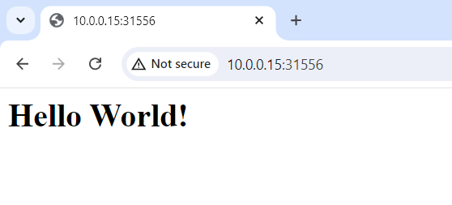

# Kubernetes Persistent Volume

## kubelet nodes

|    hostname    |  role  |  LAN IP   |
|----------------|--------|-----------|
| k8s-controller | master | 10.0.0.15 |
|   k8s-node1    | worker | 10.0.0.21 |
|   k8s-node2    | worker | 10.0.0.22 |
|   k8s-node3    | worker | 10.0.0.23 |

## Install NFS Server

## install CSI NFS Driver

The git repository URL of csi-driver-nfs: https://github.com/kubernetes-csi/csi-driver-nfs.git

We use helm to install the CSI NFS driver. Run the following commands on k8s-controller to add the helm repository, and install the driver into namespace `kube-system`.

```bash
helm repo add csi-driver-nfs https://raw.githubusercontent.com/kubernetes-csi/csi-driver-nfs/master/charts
helm install csi-driver-nfs csi-driver-nfs/csi-driver-nfs --namespace kube-system --version v4.7.0
```

## install nfs provisioner

The git repository URL of nfs-subdir-external-provisioner: https://github.com/kubernetes-sigs/nfs-subdir-external-provisioner.git

Run the following command to add the helm repository.

```bash
helm repo add nfs-subdir-external-provisioner https://kubernetes-sigs.github.io/nfs-subdir-external-provisioner/
```

Then run the following command to install NFS provisioner into namespace `kube-system` using helm.

```bash
helm install nfs-subdir-external-provisioner nfs-subdir-external-provisioner/nfs-subdir-external-provisioner -n kube-system \
    --set nfs.server=k8s-controller \
    --set nfs.path=/data/nfs/rw \
    --set storageClass.archiveOnDelete="false" \
    --set storageClass.defaultClass="nfs-client"
```

其中额外自定义设置的参数如下：

- nfs.server：NFS服务器的FQDN或者IP地址。由于之前将NFS服务器搭建在 master 节点上，所以这里就填 master 节点的 hostname，`k8s-controller`。
- nfs.path：NFS 服务器上存放 NFS Persistent Volume 的路径。这个路径需要提前在 NFS 的 `/etc/exports` 中向外 export，这里填 master 上 export 的具有读写权限的目录 `/data/nfs/rw`。
- storageClass.archiveOnDelete：在删除了 PVC 之后是否将其归档。当该参数被设置为 `true` 时，那么通过 NFS 的 Storage Class 创建的 PVC 在被删除时其对应的 PV 不会被删除，而仅仅会被更改名称。为了节省实验环境的存储空间，这里将其设置为 `false`。
- storageClass.defaultClass：NFS Provisioner 关联的 Storage Class 的名称。在安装 Provisioner 的过程中，会创建一个对应的 Storage Class，并以该参数的值命名。

## Validation

在完成上述安装后，查看 `kube-system` 命名空间下的 deployment，可以看到 NFS provisioner 的 deployment 已经被创建。

```bash
root@k8s-controller:/home/ubuntu/volumes# kubectl get deploy -n kube-system
NAME                              READY   UP-TO-DATE   AVAILABLE   AGE
coredns                           2/2     2            2           5d14h
csi-nfs-controller                1/1     1            1           19h
nfs-subdir-external-provisioner   1/1     1            1           20s
```

再查看现有的 Storage Class，可以看到 `nfs-client` 即为刚刚安装的 NFS storage class。

```bash
root@k8s-controller:/home/ubuntu/volumes# kubectl get sc
NAME                   PROVISIONER                                     RECLAIMPOLICY   VOLUMEBINDINGMODE   ALLOWVOLUMEEXPANSION   AGE
nfs-client (default)   cluster.local/nfs-subdir-external-provisioner   Delete          Immediate           true                   52s
```

通过以下命令创建一个 nginx 服务，将80端口作为 NodePort 暴露出去，使用 nfs-client 的 StorageClass 创建一个 PVC，将其挂载到 pod 中的路径 `/usr/share/nginx/html`。

```bash
kubectl apply -f - <<EOF
---
apiVersion: v1
kind: Service
metadata:
  name: nginx-sc
  labels:
    app: nginx-sc
spec:
  type: NodePort
  selector:
    app: nginx-sc
  ports:
  - name: web
    port: 80
    protocol: TCP
---
apiVersion: apps/v1
kind: StatefulSet
metadata:
  name: nginx-sc
spec:
  selector:
    matchLabels:
      app: nginx-sc
  serviceName: "nginx-sc"
  replicas: 1
  template:
    metadata:
      labels:
        app: nginx-sc
    spec:
      containers:
      - name: nginx-sc
        image: nginx
        imagePullPolicy: IfNotPresent
        volumeMounts:
        - name: nginx-pvc
          mountPath: /usr/share/nginx/html
  volumeClaimTemplates:
  - metadata:
      name: nginx-pvc
    spec:
      storageClassName: nfs-client
      accessModes: [ "ReadWriteMany" ]
      resources:
        requests:
          storage: 1Gi
EOF
```

创建完成后通过以下命令查看 default 命名空间存在的服务，可以看到刚刚创建的 `nginx-sc` 服务的 80 端口被映射到了 master 节点的 31556 端口，之后我们将会通过 master 节点的 IP 地址以及这个端口在浏览器中访问 nginx 服务。

```bash
root@k8s-controller:/home/ubuntu/volumes# kubectl get svc -o wide
NAME         TYPE        CLUSTER-IP      EXTERNAL-IP   PORT(S)        AGE     SELECTOR
kubernetes   ClusterIP   10.96.0.1       <none>        443/TCP        5d14h   <none>
nginx        ClusterIP   None            <none>        80/TCP         4d      app=nginx
nginx-sc     NodePort    10.100.251.38   <none>        80:31556/TCP   60s     app=nginx-sc
```

查看当前存在的 PVC

```bash
root@k8s-controller:/home/ubuntu/volumes# kubectl get pvc
NAME                   STATUS   VOLUME                                     CAPACITY   ACCESS MODES   STORAGECLASS   VOLUMEATTRIBUTESCLASS   AGE
nginx-pvc-nginx-sc-0   Bound    pvc-bcc2f1e1-19aa-4b93-8418-b23340bd77e8   1Gi        RWO            nfs-client     <unset>                 18h
```

在 master 节点上查看 `/data/nfs/rw` 下目录项，可以看到 `nginx-pvc` 服务对应的 PVC 被存放到了 `default-nginx-pvc-nginx-sc-0-pvc-bcc2f1e1-19aa-4b93-8418-b23340bd77e8` 目录下。

```bash
root@k8s-controller:/home/ubuntu/volumes# ls /data/nfs/rw -lh
total 8.0K
drwxrwxrwx 2 root root 4.0K Jun 30 02:08 default-nginx-pvc-nginx-sc-0-pvc-bcc2f1e1-19aa-4b93-8418-b23340bd77e8
drwxrwxrwx 2 root root 4.0K Jun 30 20:12 default-www-web-0-pvc-1ffa0622-2fb8-42e0-b1fd-724673a594ad
```

现在在该目录下创建一个自定义的 `index.html` 文件。

```bash
root@k8s-controller:~# cat - >> /data/nfs/rw/default-nginx-pvc-nginx-sc-0-pvc-bcc2f1e1-19aa-4b93-8418-b23340bd77e8/index.html <<EOF
<h1>Hello World!</h1>
EOF
```

Now we access the master node with url http://10.0.0.15:31556 , and what it returns should be the file we wrote to the path of the PVC on the master node.


