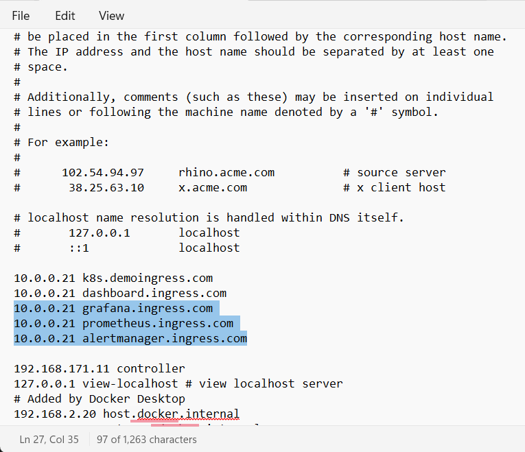

@TODO:

# Kubernetes Kube-Prometheus

## installation

Its git repository: https://github.com/prometheus-operator/kube-prometheus

```bash
sed -e "s/- --bind-address=127.0.0.1/- --bind-address=0.0.0.0/" -i /etc/kubernetes/manifests/kube-controller-manager.yaml
sed -e "s/- --bind-address=127.0.0.1/- --bind-address=0.0.0.0/" -i /etc/kubernetes/manifests/kube-scheduler.yaml
```

Clone kube-prometheus repository.

```bash
git clone https://github.com/prometheus-operator/kube-prometheus
cd kube-prometheus/
```

Delete all the configuration files defining network policies, so that the grafana dashboard can receive ingress traffic.

```bash
rm manifests/*-networkPolicy.yaml
```

Execute the following command to install kube-prometheus.

```bash
kubectl apply --server-side -f manifests/setup
kubectl wait \
	--for condition=Established \
	--all CustomResourceDefinition \
	--namespace=monitoring
kubectl apply -f manifests/
```

Then execute the following script to create nginx ingress to grafana, prometheus, and alertmanager dashboard.

```bash
kubectl apply -f - <<EOF
apiVersion: networking.k8s.io/v1
kind: Ingress
metadata:
  namespace: monitoring
  name: prometheus-ingress
spec:
  ingressClassName: "nginx"
  rules:
  - host: grafana.ingress.com
    http:
      paths:
      - pathType: Prefix
        path: "/"
        backend:
          service:
            name: grafana
            port: 
              name: http
  - host: prometheus.ingress.com
    http:
      paths:
      - pathType: Prefix
        path: "/"
        backend:
          service:
            name: prometheus-k8s
            port:
              name: web
  - host: alertmanager.ingress.com
    http:
      paths:
      - pathType: Prefix
        path: "/"
        backend:
          service:
            name: alertmanager-main
            port:
              name: web
EOF
```

Add the follwing entries into hosts file, pointing the three entries to the node running nginx ingress controller, which is `10.0.0.21` in this cluster. the path to hosts for linux is `/etc/hosts`, and for windows is `C:\Windows\System32\drivers\etc\hosts`.



Now users can access prometheus dashboard, alertmanager dashboard, and grafana dashboard in web-browsers.


The default username and password for grafana dashboard are `admin` and `admin`.
