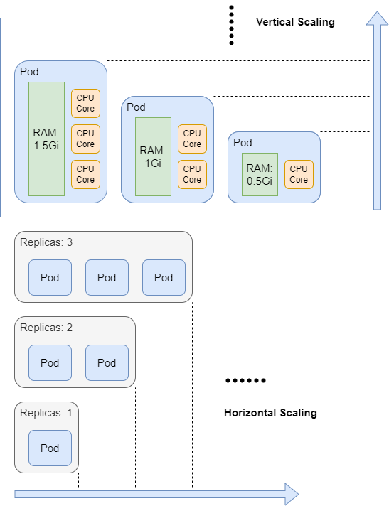

# Resource Scaling

Kubernetes 的一大优势就是资源的可拓展性，由此搭建在 Kubernetes 之上的服务可以在流量高峰期的时候快速对服务器进行扩容，防止过载；而在低峰期时可以快速缩容，以减少空置资源所带来的额外费用。并且无论扩容还是缩容，都可以不对服务器进行重启，整个过程对用户而言是无感知的。

在 Kubernetes 里有两种方式对服务进行扩缩容，分别为水平扩缩容和垂直扩缩容。水平扩缩容指改变 pod 副本的数量，而垂直扩缩容指改变现有的 pod 的可用资源数量。



## Horizontal Scaling

Horizontal Scaling 会改变 Pod 副本的数量，因此适用于 `Deployments` 和 `StatefulSets` 。而 `DaemonSet` 的 Pod 副本数量取决于满足特定条件的节点的数量，因此 Horizontal Scaling 对其是无意义的。

Pod 副本的数量在 `Deployments` 和 `StatefulSets` 创建时由 `spec.replicas` 字段的值决定，下面创建一个名为 `sample-deploy` 的 `Deployment` 作为演示，指定其初始的副本数量为1。首先创建名为 `sample-deploy.yaml` 的 yaml 文件，并写下面的内容。

```yaml
apiVersion: apps/v1
kind: Deployment
metadata:
  name: sample-deploy
  labels:
    app: sample-deploy
spec:
  replicas: 1
  selector:
    matchLabels:
      app: sample-deploy
  template:
    metadata:
      labels:
        app: sample-deploy
    spec:
      containers:
      - name: sample-deploy
        image: nginx:1.14.2
        ports:
        - containerPort: 80
```

执行 `kubectl apply -f sample-deploy.yaml` 来根据 `sample-deploy.yaml` 文件创建 `Deployment`。过后查看新创建的 `sample-deploy`，显示其有一个副本，且都处于 Ready 状态。

```bash
$ kubectl get deploy sample-deploy

NAME            READY   UP-TO-DATE   AVAILABLE   AGE
sample-deploy   1/1     1            1           2m45s
```

通过执行 `kubectl scale` 命令可以实现 Deployment 的 Horizontal Scaling。通过执行下面的命令将 `sample-deploy` 的副本数量扩大到2。

`kubectl scale deployments/sample-deploy --replicas=2`

再次查看 `sample-deploy` 可以看到其中的副本数量以及扩展到了2，且都处于 Ready 状态。

```bash
$ kubectl get deploy sample-deploy
NAME            READY   UP-TO-DATE   AVAILABLE   AGE
sample-deploy   2/2     2            2           4m42s
```

通过执行 `kubectl patch` 命令也可实现 Deployment 的 Horizontal Scaling。通过执行下面的命令将 `sample-deploy` 的副本数量扩大到3。其中 `-p` 后跟着的是一串 json 格式的字符串，这里指定将 `spec.replicas` 字段的值修改到3。

`kubectl patch deployments/sample-deploy -p '{"spec":{"replicas":3}}'`

再次查看 `sample-deploy` 可以看到其中的副本数量以及扩展到了3，且都处于 Ready 状态。

```bash
$ kubectl get deploy sample-deploy
NAME            READY   UP-TO-DATE   AVAILABLE   AGE
sample-deploy   3/3     3            3           45m
```

最后执行 `kubectl describe deploy sample-deploy` 可以看到 `sample-deploy` 更详细的信息。从这条命令的输出中可以看到它经历了两次扩容，副本数量分别从1扩展到了2，再从2扩展到了3。

```bash
Name:                   sample-deploy
Namespace:              default
CreationTimestamp:      Sun, 14 Jul 2024 18:35:35 +0000
Labels:                 app=sample-deploy
Annotations:            deployment.kubernetes.io/revision: 1
Selector:               app=sample-deploy
Replicas:               3 desired | 3 updated | 3 total | 3 available | 0 unavailable
StrategyType:           RollingUpdate
MinReadySeconds:        0
RollingUpdateStrategy:  25% max unavailable, 25% max surge
Pod Template:
  Labels:  app=sample-deploy
  Containers:
   sample-deploy:
    Image:        nginx:1.14.2
    Port:         80/TCP
    Host Port:    0/TCP
    Environment:  <none>
    Mounts:       <none>
  Volumes:        <none>
Conditions:
  Type           Status  Reason
  ----           ------  ------
  Progressing    True    NewReplicaSetAvailable
  Available      True    MinimumReplicasAvailable
OldReplicaSets:  <none>
NewReplicaSet:   sample-deploy-c685f6556 (3/3 replicas created)
Events:
  Type    Reason             Age   From                   Message
  ----    ------             ----  ----                   -------
  Normal  ScalingReplicaSet  47m   deployment-controller  Scaled up replica set sample-deploy-c685f6556 to 1
  Normal  ScalingReplicaSet  42m   deployment-controller  Scaled up replica set sample-deploy-c685f6556 to 2 from 1
  Normal  ScalingReplicaSet  99s   deployment-controller  Scaled up replica set sample-deploy-c685f6556 to 3 from 2
```

Run `kubectl delete -f sample-deploy.yam` to clean it up.

## Horizontal Pod Autoscaler

Kubernetes 的扩容缩容被用于应对服务负载的变化，而 `Horizontal Pod Autoscaler` （简写为`HPA`）会可以根据服务当前的需求调整 Pod 副本的数量，在 1.23 版本中首次被引入。

要使用 HPA，需要预先部署 [`metrics-server`](https://github.com/kubernetes-sigs/metrics-server#readme) 用于搜集当前集群中的 metrics 信息，并设置其通过 Kubernetes API 暴露这些 metrics 信息。如果 Metrics Server 被正确部署，在 `kubectl get apiservice` 命令的输出中可以看到对应的 API Service，默认是 `v1beta1.metrics.k8s.io`。

```bash
$ kubectl get apiservice | grep metrics
v1beta1.metrics.k8s.io                 kube-system/metrics-server   True        4d18h
```

为了测试 HPA，首先创建名为 `sample-deploy-hpa.yaml` 的 yaml 文件，并将以下内容写入其中。

```yaml
---
apiVersion: v1
kind: Service
metadata:
  name: sample-deploy
spec:
  selector:
    app: sample-deploy
  ports:
    - protocol: TCP
      port: 80
      targetPort: 80
---
apiVersion: apps/v1
kind: Deployment
metadata:
  name: sample-deploy
  labels:
    app: sample-deploy
spec:
  replicas: 3
  selector:
    matchLabels:
      app: sample-deploy
  template:
    metadata:
      labels:
        app: sample-deploy
    spec:
      containers:
      - name: sample-deploy
        image: nginx:1.14.2
        ports:
        - containerPort: 80
        resources:
          limits:
            cpu: 500m
          requests:
            cpu: 200m
```

保存退出后，在控制台中输入并执行 `kubectl apply -f sample-deploy-hpa.yaml` 创建 Deployment 以及 Service，执行后查看 `sample-deploy` 的状态，可见目前副本数量为3。

```bash
$ kubectl get deploy sample-deploy
NAME            READY   UP-TO-DATE   AVAILABLE   AGE
sample-deploy   3/3     3            3           16s
```

通过执行 `kubectl autoscale` 命令创建 HPA。针对刚刚创建的 Deployment 执行下面的指令创建 HPA，其中参数 `--cpu-percent=10` 表示  HPA 会通过改变 Pod 副本的数量使得所有 Pod 的平均 CPU 使用率保持在 10% 上下，并且 Pod 副本数量在 1 到 10 之间。

`kubectl autoscale deployment sample-deploy --cpu-percent=10 --min=1 --max=10`

等待一分钟后，执行 `kubectl get hpa` 可以看到 HPA 的状态。

```bash
$ kubectl get hpa
NAME            REFERENCE                  TARGETS   MINPODS   MAXPODS   REPLICAS   AGE
sample-deploy   Deployment/sample-deploy   0%/10%    1         10        1          18m
```

再查看 `sample-deploy` 的状态，由于现在的 CPU 使用率为 0%，小于阈值 10%，其 Pod 副本的数量已经收缩到了1。

```bash
$ kubectl get deploy sample-deploy
NAME            READY   UP-TO-DATE   AVAILABLE   AGE
sample-deploy   1/1     1            1           30m
```

为了让 HPA 自动增加 Pod 副本的数量，需要手动制造对 sample-deploy 的负载，使得 sample-deploy 中每个 Pod 的 CPU 使用率大于阈值 10%。创建名为 `load-generator.yaml` 的 yaml 文件，并输入以下内容。

```yaml
apiVersion: v1
kind: Pod
metadata:
  name: load-generator
spec:
  containers:
  - name: load-generator
    image: busybox:1.28
    command:
    - /bin/sh
    - -c
    - while sleep 0.001; do wget -q -O- http://sample-deploy; done
  restartPolicy: Never
```

保存并退出，执行 `kubectl apply -f load-generator.yaml` 创建 Pod。等待一分钟后，查看 HPA 的状态，从 TATGETS 字段可以看出 sample-deploy 中平均每个 Pod 的 CPU 使用率为 12%，而副本的数量增加到了3。

```bash
$ kubectl get hpa
NAME            REFERENCE                  TARGETS   MINPODS   MAXPODS   REPLICAS   AGE
sample-deploy   Deployment/sample-deploy   12%/10%   1         10        3          55m
```

查看 Deployment 的状态，确定现在 sample-deploy 的副本增加到了3。

```bash
$ kubectl get deploy sample-deploy
NAME            READY   UP-TO-DATE   AVAILABLE   AGE
sample-deploy   3/3     3            3           12m
```

执行以下命令删除制造负载的 Pod。

`kubectl delete -f load-generator.yaml`

等待一分钟后查看 HPA 的状态，其 CPU 使用率降回了 0%，且 Pod 副本数量降回了1。

```bash
$ kubectl get hpa
NAME            REFERENCE                  TARGETS   MINPODS   MAXPODS   REPLICAS   AGE
sample-deploy   Deployment/sample-deploy   0%/10%    1         10        1          68m
```

查看 sample-deploy 的状态，确定其副本数量回到了1。

```bash
$ kubectl get deploy sample-deploy
NAME            READY   UP-TO-DATE   AVAILABLE   AGE
sample-deploy   1/1     1            1           23m
```

为了测试副本数量达到 MAXPODS 时会不会继续增加，创建一个名为 `load-generator1.yaml` 的文件，在其中输入如下内容。

```yaml
apiVersion: apps/v1
kind: Deployment
metadata:
  name: load-generator
  labels:
    app: load-generator
spec:
  replicas: 5
  selector:
    matchLabels:
      app: load-generator
  template:
    metadata:
      labels:
        app: load-generator
    spec:
      containers:
      - name: load-generator
        image: busybox:1.28
        command:
          - /bin/sh
          - -c
          - while true; do wget -q -O- http://sample-deploy; done
```

保存并退出后执行 `kubectl apply -f load-generator1.yaml`，创建一个用于制造负载的 Deployment，因为其中有五个副本，能够轻易占满 sample-deploy 的资源。

等待一分钟后查看 HPA 状态，可以看到平均的 CPU 使用率达到了 30%，远高于 10%，但副本数量却保持在了10，也就是 MAXPODS 字段的值。

```bash
$ kubectl get hpa
NAME            REFERENCE                  TARGETS   MINPODS   MAXPODS   REPLICAS   AGE
sample-deploy   Deployment/sample-deploy   30%/10%   1         10        10         93m
```

除了直接使用 `kubectl autoscale` 命令创建 HPA，也可以使用 yaml 文件创建 HPA。

```yaml
apiVersion: autoscaling/v2
kind: HorizontalPodAutoscaler
metadata:
  name: sample-hpa
spec:
  scaleTargetRef:
    apiVersion: apps/v1
    kind: Deployment
    name: sample-deploy
  minReplicas: 1
  maxReplicas: 10
  metrics:
  - type: Resource
    resource:
      name: cpu
      target:
        type: Utilization
        averageUtilization: 20
```

`kubectl apply -f sample-hpa.yaml`

## Vertical Scaling
