**Learning and Practicing Docker**

1. **Learning Docker**
   1. **What is Docker?**

      Docker is a virtualization software. It is a container runtime technology that allows you to build, test, and deploy applications faster than traditional methods.

   1. **What’s the benefit of using Docker?**

      For our project, Docker simplifies DevOps processes by integrating seamlessly with CI/CD pipelines, enhancing deployment efficiency and reliability. It is lightweight and efficient, using fewer resources compared to virtual machines. 

1. **Step-by-Step Process**
1) **Setting up Docker and environment**

   We can install the Docker Desktop from the Docker official website.

   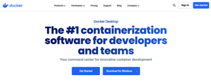

   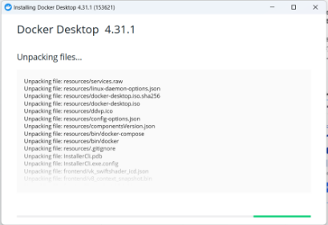

   Then we need to use Visual Studio Code and install a Docker extension for it

   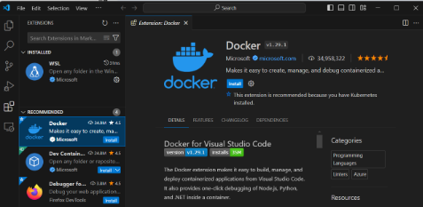

1) **Create a new workspace named “main.py” in the VS Code new project.**

   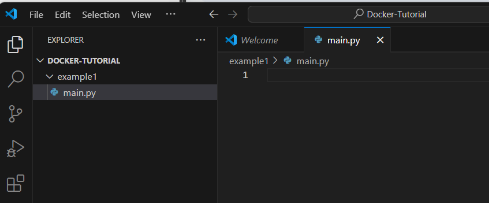

   In the python terminal, Use the “cd example1” to tap into my new directory

   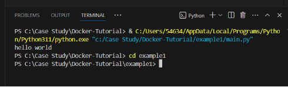

   Copy and paste any pre-existing Python application code into “main.py”. 

   In this case, I’m just using “Hello World” for testing.

   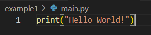

1) **After creating the python app, we need the basic Docker components for it to function properly.**

First we create a “Dockerfile” in the new directory.

` `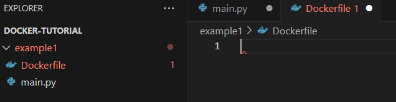

Then, we use this command to pull down a tagged python base image

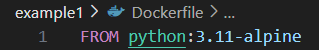

Then we add our python file into Docker using “ADD”.

After that, we enter the command that will execute once the container has started

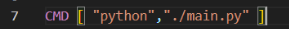

1) **Build the image within VS Code.**

   We can build the image using the command “docker build -t imagename .”

   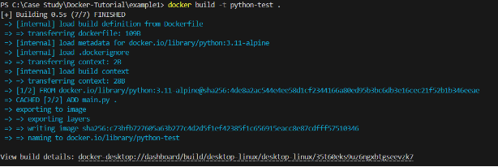

   After that, we can run our Python application using the docker we just built.

   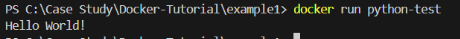

   As we can see, it outputs the “Hello World!” as my app was designed. We can also find the Container we built in run Desktop App.

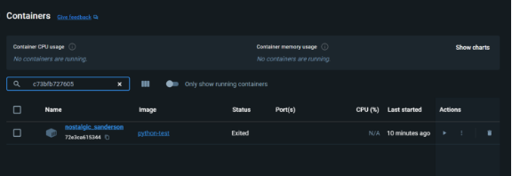

