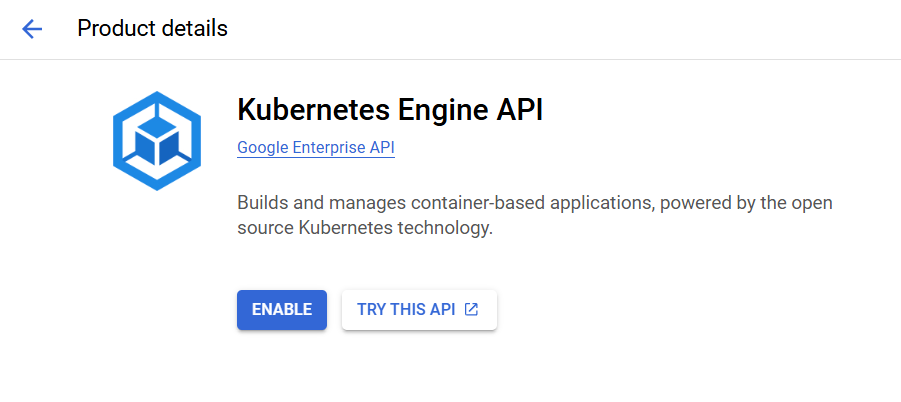

# Install GKE and Deploy a Sample App

Google Kubernetes Engine (GKE) is a managed [Kubernetes](https://kubernetes.io/) service that you can use to deploy and operate containerized applications at scale using Google's infrastructure. 

In this section, we are going to install GKE in Google Cloud Platform and test it.

## Before it begins

1. In the Google Cloud console, on the project selector page, select or create a Google Cloud Project.
2. Enable Artifact Registry API and Kubernetes Engine API

## 

## Launch Cloud Shell

Go to the Google Cloud console and activate the Cloud Shell, and set the default project to the one we are working on.


## Create a GKE cluster

In this section, we are going to Create an Autopilot cluster and name it `cluster-sample`

```sh
gcloud container clusters create-auto cluster-sample \
    --location=us-central1
```

After several minutes, we can see it successfully installed and running.


## Deploy an application to the cluster

In this case, we will deploy a example web application, `hello-app`.

### Create the Deployment

By running the following command, we can create a deployment:

```
kubectl create deployment hello-server \
    --image=us-docker.pkg.dev/google-samples/containers/gke/hello-app:1.0
```

This Kubernetes command, creates a Deployment named `hello-server`. The Deployment's Pod runs the `hello-app` container image.


We can see that the hello-server is created.

### Expose the Deployment

After deploying the application, we have to expose it to the internet so that we can access it.

To expose it, we run the following `kubectl expose` command:

```
kubectl expose deployment hello-server \
    --type LoadBalancer \
    --port 80 \
    --target-port 8080
```

After that, we can access the application by using the external IP address.


