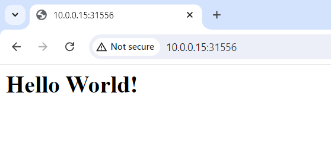

# Kubernetes Persistent Volume

## kubelet nodes

|    hostname    |  role  |  LAN IP   |
|----------------|--------|-----------|
| k8s-controller | master | 10.0.0.15 |
|   k8s-node1    | worker | 10.0.0.21 |
|   k8s-node2    | worker | 10.0.0.22 |
|   k8s-node3    | worker | 10.0.0.23 |

## Install NFS Server

Install NFS server on master node

```bash
root@k8s-controller:~# sudo apt install nfs-kernel-server
```

Install NFS client on all nodes

```bash
root@k8s-controller:~# sudo apt install nfs-common
```

Directories to be exported should be added to `/etc/exports`. We first created two directories `/data/nfs/rw` and `/data/nfs/ro`, then export `rw` as read and write directory to subnet `10.0.0.0/24`, and export `ro` as readonly directory.

```conf
/data/nfs/rw    10.0.0.0/24(rw,sync,no_subtree_check,no_root_squash)
/data/nfs/ro    10.0.0.0/24(ro,sync,no_subtree_check,no_root_squash)
```

Then restart the nfs service to reload the configuration.

```bash
root@k8s-controller:~# service nfs-kernel-server restart
```

## install CSI NFS Driver

The git repository URL of csi-driver-nfs: https://github.com/kubernetes-csi/csi-driver-nfs.git

We use helm to install the CSI NFS driver. Run the following commands on k8s-controller to add the helm repository, and install the driver into namespace `kube-system`.

```bash
helm repo add csi-driver-nfs https://raw.githubusercontent.com/kubernetes-csi/csi-driver-nfs/master/charts
helm install csi-driver-nfs csi-driver-nfs/csi-driver-nfs --namespace kube-system --version v4.7.0
```

## install nfs provisioner

The git repository URL of nfs-subdir-external-provisioner: https://github.com/kubernetes-sigs/nfs-subdir-external-provisioner.git

Run the following command to add the helm repository.

```bash
helm repo add nfs-subdir-external-provisioner https://kubernetes-sigs.github.io/nfs-subdir-external-provisioner/
```

Then run the following command to install NFS provisioner into namespace `kube-system` using helm.

```bash
helm install nfs-subdir-external-provisioner nfs-subdir-external-provisioner/nfs-subdir-external-provisioner -n kube-system \
    --set nfs.server=k8s-controller \
    --set nfs.path=/data/nfs/rw \
    --set storageClass.archiveOnDelete="false" \
    --set storageClass.defaultClass="nfs-client"
```

The custom parameters are as follows:

- nfs.server: The FQDN or IP address of the NFS server. Since we set up the NFS server on the master node earlier, we use the hostname of the master node here, which is `k8s-controller`.
- nfs.path: The path on the NFS server where the NFS Persistent Volume is stored. This path must be exported in the NFS `/etc/exports` file. Here, we use the read-write directory exported on the master node `/data/nfs/rw`.
- storageClass.archiveOnDelete: Whether to archive the PVC after it is deleted. When this parameter is set to `true`, the PV corresponding to the PVC created through the NFS Storage Class will not be deleted when the PVC is deleted, but will simply have its name changed. To save storage space in the experimental environment, it is set to `false`.
- storageClass.defaultClass: The name of the Storage Class associated with the NFS Provisioner. During the installation of the Provisioner, a corresponding Storage Class is created and named according to the value of this parameter.

## Validation

After its installation, check the deployments under namespace `kube-system` , and we can see the deployment for NFS provisioner has been created。

```bash
root@k8s-controller:/home/ubuntu/volumes# kubectl get deploy -n kube-system
NAME                              READY   UP-TO-DATE   AVAILABLE   AGE
coredns                           2/2     2            2           5d14h
csi-nfs-controller                1/1     1            1           19h
nfs-subdir-external-provisioner   1/1     1            1           20s
```

Lets check the Storage Classes, and we can see the newly installed Storage Class named `nfs-client`。

```bash
root@k8s-controller:/home/ubuntu/volumes# kubectl get sc
NAME                   PROVISIONER                                     RECLAIMPOLICY   VOLUMEBINDINGMODE   ALLOWVOLUMEEXPANSION   AGE
nfs-client (default)   cluster.local/nfs-subdir-external-provisioner   Delete          Immediate           true                   52s
```

Execute the follwing command to create an nginx service, exposing port 80 as Node Port. In the corresponding deployment, create a PVC as Storage Class `nfs-client`, and mount it to `/usr/share/nginx/html` inside the nginx pod.

```bash
kubectl apply -f - <<EOF
---
apiVersion: v1
kind: Service
metadata:
  name: nginx-sc
  labels:
    app: nginx-sc
spec:
  type: NodePort
  selector:
    app: nginx-sc
  ports:
  - name: web
    port: 80
    protocol: TCP
---
apiVersion: apps/v1
kind: StatefulSet
metadata:
  name: nginx-sc
spec:
  selector:
    matchLabels:
      app: nginx-sc
  serviceName: "nginx-sc"
  replicas: 1
  template:
    metadata:
      labels:
        app: nginx-sc
    spec:
      containers:
      - name: nginx-sc
        image: nginx
        imagePullPolicy: IfNotPresent
        volumeMounts:
        - name: nginx-pvc
          mountPath: /usr/share/nginx/html
  volumeClaimTemplates:
  - metadata:
      name: nginx-pvc
    spec:
      storageClassName: nfs-client
      accessModes: [ "ReadWriteMany" ]
      resources:
        requests:
          storage: 1Gi
EOF
```

After creation of the example service, check the services in the default namespace, and we can see that the 80 port of the nginx-sc service has been mapped to port 31556 of the master node. We will access the nginx service in the browser using the master node's IP address and this port.

```bash
root@k8s-controller:/home/ubuntu/volumes# kubectl get svc -o wide
NAME         TYPE        CLUSTER-IP      EXTERNAL-IP   PORT(S)        AGE     SELECTOR
kubernetes   ClusterIP   10.96.0.1       <none>        443/TCP        5d14h   <none>
nginx        ClusterIP   None            <none>        80/TCP         4d      app=nginx
nginx-sc     NodePort    10.100.251.38   <none>        80:31556/TCP   60s     app=nginx-sc
```

Check the PVC just created.

```bash
root@k8s-controller:/home/ubuntu/volumes# kubectl get pvc
NAME                   STATUS   VOLUME                                     CAPACITY   ACCESS MODES   STORAGECLASS   VOLUMEATTRIBUTESCLASS   AGE
nginx-pvc-nginx-sc-0   Bound    pvc-bcc2f1e1-19aa-4b93-8418-b23340bd77e8   1Gi        RWO            nfs-client     <unset>                 18h
```

On the master node, check the directory items under /data/nfs/rw, and we can see that the PVC corresponding to the nginx-pvc service is stored in the directory default-nginx-pvc-nginx-sc-0-pvc-bcc2f1e1-19aa-4b93-8418-b23340bd77e8.

```bash
root@k8s-controller:/home/ubuntu/volumes# ls /data/nfs/rw -lh
total 8.0K
drwxrwxrwx 2 root root 4.0K Jun 30 02:08 default-nginx-pvc-nginx-sc-0-pvc-bcc2f1e1-19aa-4b93-8418-b23340bd77e8
drwxrwxrwx 2 root root 4.0K Jun 30 20:12 default-www-web-0-pvc-1ffa0622-2fb8-42e0-b1fd-724673a594ad
```

Now, create a custom index.html file in this directory as the index page when accessing the nginx server.

```bash
root@k8s-controller:~# cat - >> /data/nfs/rw/default-nginx-pvc-nginx-sc-0-pvc-bcc2f1e1-19aa-4b93-8418-b23340bd77e8/index.html <<EOF
<h1>Hello World!</h1>
EOF
```

Now we access the master node with url http://10.0.0.15:31556 , and what it returns should be the file we wrote to the path of the PVC on the master node.


