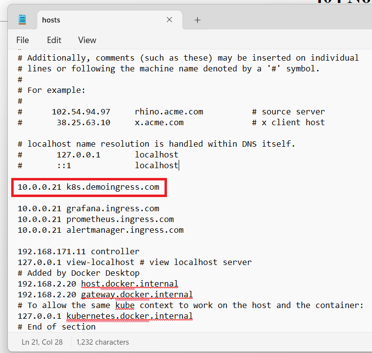
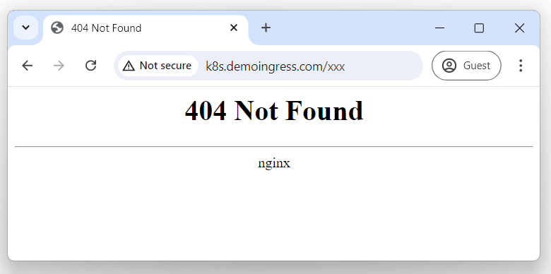
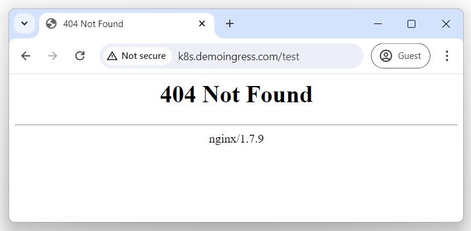

# Kubernetes Ingress

Contrary to service, ingress is an API that manages external traffic to the service in a cluster, typically http. External traffic will be forwarded to the corresponding services according to rules defined on the ingress resource.

To use ingress resources, an ingress controller is needed. There are many different ingress controllers available. In this experiment, we choose nginx ingress as the ingress controller.

## Installation

First add repo info to helm.

```bash
helm repo add ingress-nginx https://kubernetes.github.io/ingress-nginx
helm repo update
```

Label the node to run nginx ingress, so that we can specify the node to run nginx ingress with node selector.

```bash
kubectl label node k8s-node1 ingress=on
```

Execute the following command to install to install nginx ingress in namespace `ingress-nginx`.

```bash
helm install ingress-nginx ingress-nginx/ingress-nginx \
  --namespace ingress-nginx --create-namespace \
  --set controller.deploy.kind=DaemonSet \
  --set controller.nodeSelector.ingress="on" \
  --set controller.service.type=ClusterIP \
  --set controller.hostNetwork=true \
  --set controller.dnsPolicy=ClusterFirstWithHostNet \
  --set controller.admissionWebhooks.enabled=false
```

The custom parameters are as follows:

- controller.deploy.kind: `Deployment` or `DaemonSet`
- controller.nodeSelector: to choose the node to run the ingress pod by node label. This field is set to `ingress="on"` to match node1's label.
- controller.service.type: `LoadBalancer` or `ClusterIP`. Because the cluster is running locally, this field should change to `ClusterIP`. If the cluster is running in the cloud, it should keep as `LoadBalancer`
- controller.hostNetwork: to use host network or not. This field is set to `true`, because the cluster has had CNI installed already, and to use the host network means to use the CNI installed before.
- controller.dnsPolicy: change to `ClusterFirstWithHostNet` so that the nginx-controller keeps resolving names inside the k8s network.
- controller.admissionWebhooks.enabled: HTTPS certificates related. This field is set to false by now.

After its installation, you will see the following output:

```bash
NAME: ingress-nginx
LAST DEPLOYED: Tue Jul  9 19:22:48 2024
NAMESPACE: ingress-nginx
STATUS: deployed
REVISION: 1
TEST SUITE: None
NOTES:
The ingress-nginx controller has been installed.
Get the application URL by running these commands:
  export POD_NAME="$(kubectl get pods --namespace ingress-nginx --selector app.kubernetes.io/name=ingress-nginx,app.kubernetes.io/instance=ingress-nginx,app.kubernetes.io/component=controller --output jsonpath="{.items[0].metadata.name}")"
  kubectl port-forward --namespace ingress-nginx "${POD_NAME}" 8080:80
  echo "Visit http://127.0.0.1:8080 to access your application."

An example Ingress that makes use of the controller:
  apiVersion: networking.k8s.io/v1
  kind: Ingress
  metadata:
    name: example
    namespace: foo
  spec:
    ingressClassName: nginx
    rules:
      - host: www.example.com
        http:
          paths:
            - pathType: Prefix
              backend:
                service:
                  name: exampleService
                  port:
                    number: 80
              path: /
    # This section is only required if TLS is to be enabled for the Ingress
    tls:
      - hosts:
        - www.example.com
        secretName: example-tls

If TLS is enabled for the Ingress, a Secret containing the certificate and key must also be provided:

  apiVersion: v1
  kind: Secret
  metadata:
    name: example-tls
    namespace: foo
  data:
    tls.crt: <base64 encoded cert>
    tls.key: <base64 encoded key>
  type: kubernetes.io/tls
```

We can check the service installed during the process in namespace `ingress-nginx`.

```bash
root@k8s-controller:/home/ubuntu/ingress# kubectl get svc -n ingress-nginx -o wide
NAME                       TYPE        CLUSTER-IP       EXTERNAL-IP   PORT(S)          AGE   SELECTOR
ingress-nginx-controller   ClusterIP   10.106.153.132   <none>        80/TCP,443/TCP   15h   app.kubernetes.io/component=controller,app.kubernetes.io/instance=ingress-nginx,app.kubernetes.io/name=ingress-nginx
```

And its pod is running on node1.

```bash
root@k8s-controller:/home/ubuntu/ingress# kubectl get pod -n ingress-nginx -o wide
NAME                                        READY   STATUS    RESTARTS   AGE   IP          NODE        NOMINATED NODE   READINESS GATES
ingress-nginx-controller-6cbdf758b9-bnnzj   1/1     Running   0          15h   10.0.0.21   k8s-node1   <none>           <none>
```

## validation

Execute the follwing script to create a service, a pod running an empty nginx instance, and an ingress resource that matches URL: `k8s.demoingress.com/test`.

```bash
kubectl create -f - <<EOF
---
apiVersion: v1
kind: Service
metadata:
  name: demo-nginx-ingress
  labels:
    app: demo-nginx-ingress
spec:
  type: NodePort
  selector:
    app: demo-nginx-ingress
  ports:
  - name: web
    port: 80
    protocol: TCP
---
apiVersion: apps/v1
kind: Deployment
metadata:
  labels:
    app: demo-nginx-ingress
  name: demo-nginx-ingress
  namespace: default
spec:
  replicas: 1
  selector:
    matchLabels:
      app: demo-nginx-ingress
  template:
    metadata:
      labels:
        app: demo-nginx-ingress
    spec:
      containers:
      - image: nginx:1.7.9
        imagePullPolicy: IfNotPresent
        name: nginx
---
apiVersion: networking.k8s.io/v1
kind: Ingress
metadata:
  name: demo-nginx-ingress
spec:
  ingressClassName: "nginx"
  rules:
  - host: k8s.demoingress.com
    http:
      paths:
      - pathType: Prefix
        path: "/test"
        backend:
          service:
            name: demo-nginx-ingress
            port: 
              number: 80
EOF
```

The shell will return the follwing output if it succeeds.

```bash
service/demo-nginx-ingress created
deployment.apps/demo-nginx-ingress created
ingress.networking.k8s.io/demo-nginx-ingress created
```

Check the ingress resource just created.

```bash
root@k8s-controller:/home/ubuntu/ingress# kubectl get ingress
NAME                 CLASS   HOSTS                 ADDRESS          PORTS   AGE
demo-nginx-ingress   nginx   k8s.demoingress.com   10.106.153.132   80      2m48s
```

In order to send the hostname used to the nginx ingress and the demo service, we need to add the hostname with the IP address of the node running the ingress controller to hosts file. After edditing the hosts file, the operating system will access node1 when the user tries to access `k8s.demoingress.com`. the path to hosts for linux is `/etc/hosts`, and for windows is `C:\Windows\System32\drivers\etc\hosts`.



Now open a web browser windows, and access `k8s.demoingress.com`, `k8s.demoingress.com/xxx`, and `k8s.demoingress.com/test`.






All the three URLs returns nginx 404 page, but only the last one is from the demo service. And there is only one request recorded in the log of the demo pod.

```bash
root@k8s-controller:/home/ubuntu/ingress# kubectl get pod -l app=demo-nginx-ingress
NAME                                 READY   STATUS    RESTARTS   AGE
demo-nginx-ingress-7944fc795-cj689   1/1     Running   0          22m
root@k8s-controller:/home/ubuntu/ingress# kubectl logs demo-nginx-ingress-7944fc795-cj689
2024/07/02 19:01:23 [error] 2#0: *1 open() "/usr/share/nginx/html/test" failed (2: No such file or directory), client: 10.0.0.21, server: localhost, request: "GET /test HTTP/1.1", host: "k8s.demoingress.com"
10.0.0.21 - - [02/Jul/2024:19:01:23 +0000] "GET /test HTTP/1.1" 404 570 "-" "Mozilla/5.0 (Windows NT 10.0; Win64; x64) AppleWebKit/537.36 (KHTML, like Gecko) Chrome/126.0.0.0 Safari/537.36" "10.0.0.1"
```

## References

https://artifacthub.io/packages/helm/ingress-nginx/ingress-nginx
https://github.com/kubernetes/ingress-nginx
