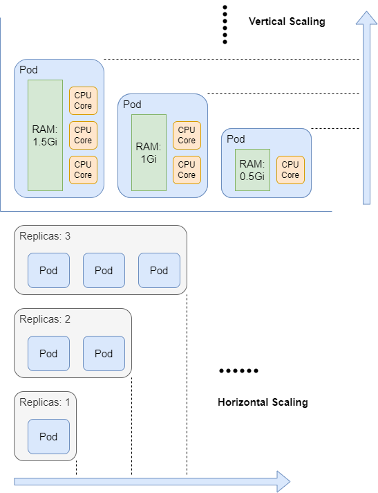

# Resource Scaling

One of the significant advantages of Kubernetes is its scalability, allowing services built on Kubernetes to quickly scale up during peak hours to prevent overload, and scale down during off-peak times to reduce additional costs from idle resources. Both scaling up and scaling down can be done without restarting the servers, making the entire process seamless and unnoticeable to the user.

In Kubernetes, there are two ways to scale services: horizontal scaling and vertical scaling. Horizontal scaling involves changing the number of replicas, while vertical scaling involves changing the amount of available resources for existing pods, like CPU cores and memory.



## Horizontal Scaling

Horizontal Scaling changes the number of replicas, making it suitable for Deployments and StatefulSets. However, the number of replicas for a DaemonSet depends on the number of nodes that meet certain conditions, so Horizontal Scaling is meaningless for it.

The number of replicas in Deployments and StatefulSets is determined by the value of the `spec.replicas` field in their manifest. Below is an example manifest of a Deployment named sample-deploy initially with 1 replica. First, create a manifest file named `sample-deploy.yaml` and write the following content.

```yaml
apiVersion: apps/v1
kind: Deployment
metadata:
  name: sample-deploy
  labels:
    app: sample-deploy
spec:
  replicas: 1
  selector:
    matchLabels:
      app: sample-deploy
  template:
    metadata:
      labels:
        app: sample-deploy
    spec:
      containers:
      - name: sample-deploy
        image: nginx:1.14.2
        ports:
        - containerPort: 80
```

Execute `kubectl apply -f sample-deploy.yaml` to create the Deployment in the sample-deploy.yaml file. Afterwards, check the newly created sample-deploy and the output shows that it has one replica in Ready status.

```bash
$ kubectl get deploy sample-deploy

NAME            READY   UP-TO-DATE   AVAILABLE   AGE
sample-deploy   1/1     1            1           2m45s
```

Horizontal Scaling for a Deployment can be achieved by executing the `kubectl scale` command. The following command scales the sample-deploy replica count to 2.

`kubectl scale deployments/sample-deploy --replicas=2`

Checking sample-deploy again shows that the number of replicas has been increased to 2, and both are in Ready status.

```bash
$ kubectl get deploy sample-deploy
NAME            READY   UP-TO-DATE   AVAILABLE   AGE
sample-deploy   2/2     2            2           4m42s
```

Horizontal Scaling for a Deployment can also be achieved by executing the `kubectl patch command`. The following command scales the sample-deploy replica count to 3. The string following `-p` is a JSON formatted string which changes the value of the spec.replicas field to 3.

`kubectl patch deployments/sample-deploy -p '{"spec":{"replicas":3}}'`

Checking the status of sample-deploy again shows that the number of replicas has been increased to 3, and all are in Ready status.

```bash
$ kubectl get deploy sample-deploy
NAME            READY   UP-TO-DATE   AVAILABLE   AGE
sample-deploy   3/3     3            3           45m
```

Finally, executing `kubectl describe deploy sample-deploy` reveals more detailed information about sample-deploy. From its output, it can be seen that sample-deploy has undergone two scaling operations, with the number of replicas increased from 1 to 2, and then from 2 to 3.

```bash
Name:                   sample-deploy
Namespace:              default
CreationTimestamp:      Sun, 14 Jul 2024 18:35:35 +0000
Labels:                 app=sample-deploy
Annotations:            deployment.kubernetes.io/revision: 1
Selector:               app=sample-deploy
Replicas:               3 desired | 3 updated | 3 total | 3 available | 0 unavailable
StrategyType:           RollingUpdate
MinReadySeconds:        0
RollingUpdateStrategy:  25% max unavailable, 25% max surge
Pod Template:
  Labels:  app=sample-deploy
  Containers:
   sample-deploy:
    Image:        nginx:1.14.2
    Port:         80/TCP
    Host Port:    0/TCP
    Environment:  <none>
    Mounts:       <none>
  Volumes:        <none>
Conditions:
  Type           Status  Reason
  ----           ------  ------
  Progressing    True    NewReplicaSetAvailable
  Available      True    MinimumReplicasAvailable
OldReplicaSets:  <none>
NewReplicaSet:   sample-deploy-c685f6556 (3/3 replicas created)
Events:
  Type    Reason             Age   From                   Message
  ----    ------             ----  ----                   -------
  Normal  ScalingReplicaSet  47m   deployment-controller  Scaled up replica set sample-deploy-c685f6556 to 1
  Normal  ScalingReplicaSet  42m   deployment-controller  Scaled up replica set sample-deploy-c685f6556 to 2 from 1
  Normal  ScalingReplicaSet  99s   deployment-controller  Scaled up replica set sample-deploy-c685f6556 to 3 from 2
```

Run `kubectl delete -f sample-deploy.yam` to clean it up.

## Horizontal Pod Autoscaler

Kubernetes scaling is used to cope with changes in service load, and the Horizontal Pod Autoscaler (HPA) can adjust the number of pod replicas based on current service demand. HPA was first introduced in version 1.23.

To use HPA, you need to deploy the metrics-server in advance to collect metrics information from the kubernetes cluster and expose this information via the Kubernetes API. If the Metrics Server is properly deployed, you will see the corresponding API Service via `kubectl get apiservice`, which is `v1beta1.metrics.k8s.io` by default.

```bash
$ kubectl get apiservice | grep metrics
v1beta1.metrics.k8s.io                 kube-system/metrics-server   True        4d18h
```

To test HPA, first create a yaml file named sample-deploy-hpa.yaml and write the following content.

```yaml
---
apiVersion: v1
kind: Service
metadata:
  name: sample-deploy
spec:
  selector:
    app: sample-deploy
  ports:
    - protocol: TCP
      port: 80
      targetPort: 80
---
apiVersion: apps/v1
kind: Deployment
metadata:
  name: sample-deploy
  labels:
    app: sample-deploy
spec:
  replicas: 3
  selector:
    matchLabels:
      app: sample-deploy
  template:
    metadata:
      labels:
        app: sample-deploy
    spec:
      containers:
      - name: sample-deploy
        image: nginx:1.14.2
        ports:
        - containerPort: 80
        resources:
          limits:
            cpu: 500m
          requests:
            cpu: 200m
```

Save and exit, then run `kubectl apply -f sample-deploy-hpa.yaml` to create the Deployment and Service. After execution, check the status of sample-deploy to see that the current number of replicas is 3.

```bash
$ kubectl get deploy sample-deploy
NAME            READY   UP-TO-DATE   AVAILABLE   AGE
sample-deploy   3/3     3            3           16s
```

Create the HPA by executing the `kubectl autoscale` command. The following command creates an HPA for the Deployment just created, where the `--cpu-percent=10` parameter indicates that the HPA will adjust the number of replicas to maintain an average CPU usage of 10% across all pods, with the number of replicas ranging from 1 to 10.

`kubectl autoscale deployment sample-deploy --cpu-percent=10 --min=1 --max=10`

Wait for a minute, then execute kubectl get hpa to see the status of the HPA.

```bash
$ kubectl get hpa
NAME            REFERENCE                  TARGETS   MINPODS   MAXPODS   REPLICAS   AGE
sample-deploy   Deployment/sample-deploy   0%/10%    1         10        1          18m
```

Check the status of sample-deploy again, and since the current CPU usage is 0%, which is below the threshold of 10%, the number of pod replicas has been reduced to 1 automatically.

```bash
$ kubectl get deploy sample-deploy
NAME            READY   UP-TO-DATE   AVAILABLE   AGE
sample-deploy   1/1     1            1           30m
```

To make the HPA automatically increase the number of replicas, you need to manually generate loads on sample-deploy so that the CPU usage of each pod exceeds the threshold of 10%. Create a yaml file named `load-generator.yaml` and input the following content.

```yaml
apiVersion: v1
kind: Pod
metadata:
  name: load-generator
spec:
  containers:
  - name: load-generator
    image: busybox:1.28
    command:
    - /bin/sh
    - -c
    - while sleep 0.001; do wget -q -O- http://sample-deploy; done
  restartPolicy: Never
```

Save and exit, then execute `kubectl apply -f load-generator.yaml` to create the Pod. Wait for a minute, then check the status of the HPA. The TARGETS field shows that the average CPU usage of each pod in sample-deploy is 12%, and the number of replicas has increased to 3.

```bash
$ kubectl get hpa
NAME            REFERENCE                  TARGETS   MINPODS   MAXPODS   REPLICAS   AGE
sample-deploy   Deployment/sample-deploy   12%/10%   1         10        3          55m
```

Check the status of sample-deploy to confirm that the number of replicas has increased to 3.

```bash
$ kubectl get deploy sample-deploy
NAME            READY   UP-TO-DATE   AVAILABLE   AGE
sample-deploy   3/3     3            3           12m
```

Run the following command to delete the load-generating Pod.

`kubectl delete -f load-generator.yaml`

Wait for a minute and then check the status of the HPA. The CPU usage has dropped back to 0%, and the number of replicas has decreased to 1.

```bash
$ kubectl get hpa
NAME            REFERENCE                  TARGETS   MINPODS   MAXPODS   REPLICAS   AGE
sample-deploy   Deployment/sample-deploy   0%/10%    1         10        1          68m
```

Check the status of sample-deploy to confirm that its replica count has returned to 1.

```bash
$ kubectl get deploy sample-deploy
NAME            READY   UP-TO-DATE   AVAILABLE   AGE
sample-deploy   1/1     1            1           23m
```

To test if the number of replicas will continue to increase when reaching the MAXPODS, create a file named `load-generator1.yaml` and input the following content.

```yaml
apiVersion: apps/v1
kind: Deployment
metadata:
  name: load-generator
  labels:
    app: load-generator
spec:
  replicas: 5
  selector:
    matchLabels:
      app: load-generator
  template:
    metadata:
      labels:
        app: load-generator
    spec:
      containers:
      - name: load-generator
        image: busybox:1.28
        command:
          - /bin/sh
          - -c
          - while true; do wget -q -O- http://sample-deploy; done
```

Save and exit, then execute `kubectl apply -f load-generator1.yaml` to create a Deployment that generates load. With five replicas, it can easily saturate the resources of sample-deploy.

Wait for a minute and then check the status of the HPA. The average CPU usage has reached 30%, well above 10%, but the number of replicas remains at 10, which matches the value of the MAXPODS field.

```bash
$ kubectl get hpa
NAME            REFERENCE                  TARGETS   MINPODS   MAXPODS   REPLICAS   AGE
sample-deploy   Deployment/sample-deploy   30%/10%   1         10        10         93m
```

In addition to using the `kubectl autoscale` command to create an HPA directly, you can also create an HPA using a yaml file.

```yaml
apiVersion: autoscaling/v2
kind: HorizontalPodAutoscaler
metadata:
  name: sample-hpa
spec:
  scaleTargetRef:
    apiVersion: apps/v1
    kind: Deployment
    name: sample-deploy
  minReplicas: 1
  maxReplicas: 10
  metrics:
  - type: Resource
    resource:
      name: cpu
      target:
        type: Utilization
        averageUtilization: 20
```

Run `kubectl apply -f sample-hpa.yaml` to apply the configuration.

## Vertical Scaling

https://kubernetes.io/docs/tasks/configure-pod-container/resize-container-resources/
